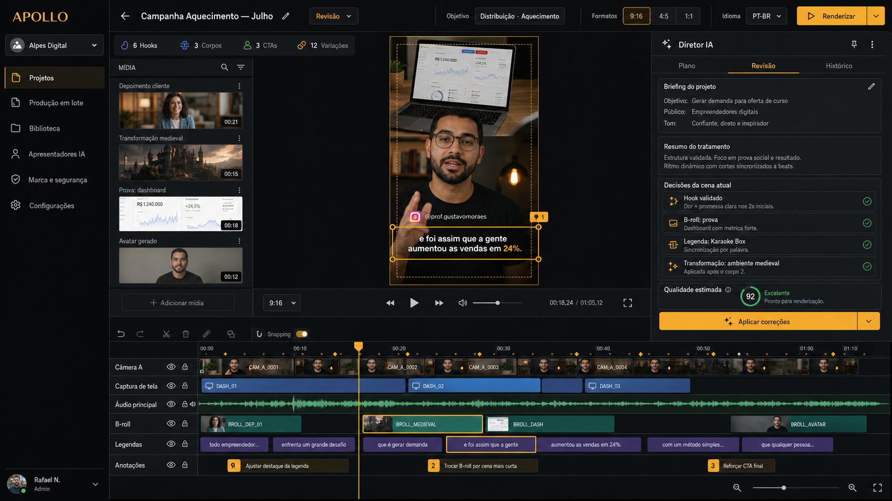
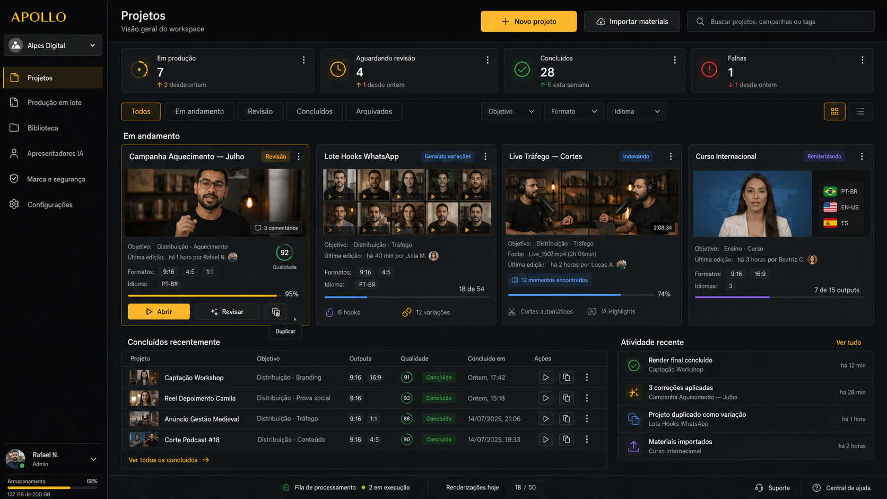

# Apollo Video v2 — Product Requirements Document

> **Status:** Draft consolidado para implementação  
> **Versão:** 1.2  
> **Data:** 12 de julho de 2026  
> **Responsável pelo produto:** Leandro / Alpes Digital  
> **Produto:** Apollo Video  
> **Natureza do documento:** PRD mestre, cobrindo visão final e entregas incrementais

### Alterações da versão 1.2

- API externa como contrato obrigatório e paritário para todas as capacidades operáveis.
- Autenticação por clientes de API, escopos, idempotência, concorrência e auditoria.
- Jobs assíncronos, webhooks/eventos e transferência segura de mídia.
- Contratos legíveis por máquinas e adapter MCP para agentes de IA e outras ferramentas.
- Spec 09 para API externa e automação.

### Alterações da versão 1.1

- Rubricas editoriais específicas por objetivo estratégico.
- Gramática editorial e regras de ritmo, B-roll e movimento.
- Sistema de aprendizado de preferências do workspace.
- Non-goals e limites explícitos do produto.
- Suíte de specs funcionais/técnicas derivadas.
- Matriz de rastreabilidade requisito → fase → dependência → aceite → teste.

---

## 1. Resumo executivo

Apollo Video v2 será uma plataforma de direção e edição de vídeos com IA capaz de receber materiais em diferentes estados de preparação — roteiro, áudio, vídeo bruto, múltiplas câmeras, lotes de takes, lives longas, vídeos publicados, depoimentos, imagens ou mídia sintética — e produzir automaticamente vídeos finalizados, revisáveis e reutilizáveis.

O produto não será apenas um gerador de cenas nem um editor tradicional com recursos de IA adicionados. Seu núcleo será um **Agente Diretor multimodal** que:

1. percebe e cataloga o material;
2. entende objetivo, mensagem, contexto e restrições;
3. define tratamento editorial e estratégia narrativa;
4. escolhe, cria ou transforma fontes;
5. compila um plano de edição determinístico;
6. renderiza um proxy;
7. assiste e critica o próprio resultado;
8. executa correções localizadas;
9. permite edição manual e comentários visuais;
10. gera outputs em múltiplos formatos, variantes e idiomas.

O Apollo v2 deverá atender dois grandes grupos de produção:

- **Distribuição de conteúdo:** descoberta, elevação de consciência e aquecimento.
- **Conversão:** captação de leads, venda, WhatsApp, agendamento e download de materiais.

O sistema será **IA-first, mas não IA-only**. O Diretor entrega uma primeira montagem completa, enquanto o usuário mantém controle manual sobre timeline, cenas, fontes, layouts, textos, legendas, formatos, cores, áudio e decisões específicas.

O Apollo atual não está em produção. Portanto, o v2 será reconstruído com um núcleo limpo no mesmo repositório, sem obrigação de manter a v1 operacional. Serão reaproveitados seletivamente componentes e aprendizados comprovados, especialmente Remotion, FFmpeg, timing, legendas, hardening de render e primitivas visuais.

---

## 2. Referências visuais aprovadas

As duas telas abaixo são referências obrigatórias de direção visual, densidade, hierarquia e experiência do produto final.

### 2.1 Editor e revisão



### 2.2 Workspace e projetos



### 2.3 Princípios visuais

- Interface desktop profissional e densa, sem aparência de landing page.
- Tema escuro grafite, superfícies em carvão, texto branco/cinza e destaque âmbar/dourado.
- Hierarquia clara entre workspace, mídia, preview, Diretor, timeline e revisão.
- Progressos, jobs, qualidade e falhas devem ser visíveis.
- A interface deve transmitir controle e confiabilidade, não “mágica opaca”.
- Ações de IA e ações manuais devem coexistir no mesmo fluxo.
- O produto deve parecer uma ferramenta de produção profissional, não um chatbot com preview.

---

## 3. Problema

Produzir vídeos de alta qualidade para anúncios e distribuição de conteúdo exige decisões que hoje dependem de um editor humano experiente:

- encontrar o melhor hook;
- cortar retakes, pausas e redundâncias;
- reorganizar a narrativa sem distorcer o sentido;
- combinar hooks, corpos e CTAs compatíveis;
- decidir quando manter o apresentador e quando usar B-roll;
- escolher provas, depoimentos e trechos de materiais antigos;
- criar quebras de padrão sem exagero;
- posicionar legendas, inserts e layouts sem cobrir elementos importantes;
- adaptar composição a formatos diferentes;
- avaliar materiais gerados por IA antes de usá-los;
- sincronizar câmeras, telas e áudios diferentes;
- preservar identidade, marca, direitos e integridade de claims;
- revisar o vídeo renderizado e corrigir problemas localizados.

O Apollo v1 automatiza parte da transcrição, análise, cenas, legendas e render, mas foi construído ao redor de um único vídeo bruto e de um pipeline linear. A visão v2 requer um domínio centrado em **workspaces, mídia reutilizável, segmentos semânticos, versões, receitas, jobs e planos editoriais**.

---

## 4. Visão do produto

### 4.1 Declaração de visão

> Transformar materiais audiovisuais brutos, fragmentados, antigos, longos ou sintéticos em produções editadas com intenção, qualidade e rastreabilidade, reduzindo o trabalho operacional sem retirar o controle editorial do usuário.

### 4.2 Resultado esperado

O usuário deverá conseguir:

- enviar apenas um vídeo bruto e receber um vídeo pronto;
- enviar roteiro + arquivos de hooks/corpos/CTAs e receber variações compatíveis;
- selecionar um vídeo já validado e reaproveitar somente seu hook;
- minerar depoimentos e provas para inserir em novas produções;
- extrair um conteúdo de dois minutos de uma live de duas horas;
- gerar apresentador sintético a partir de roteiro ou áudio;
- produzir apenas áudio + B-roll, sem pessoas;
- produzir personagem de IA + B-roll, sem pessoas reais;
- transformar cenas com IA conforme o plano do Diretor;
- trabalhar com múltiplas câmeras e captura de tela sincronizadas;
- exportar em múltiplas proporções e idiomas;
- revisar, anotar e editar manualmente;
- duplicar um projeto concluído e criar variações pontuais;
- reaproveitar qualquer mídia catalogada sem regeneração desnecessária.

---

## 5. Princípios de produto

### P-01 — A IA decide, o código garante

IA interpreta intenção, semântica, compatibilidade e qualidade. Código determinístico controla frames, ranges, timebases, limites, colisões, invalidação, persistência e render.

### P-02 — Áudio e vídeo são ativos, não arquivos descartáveis

Masters são imutáveis, derivados mantêm lineage e segmentos apontam para ranges. Nenhuma edição destrói a fonte original.

### P-03 — Estilo é consequência do tratamento

O usuário pode definir preferências, mas o Diretor deve inferir tratamento editorial, gramática visual, ritmo e densidade. Presets não substituem direção.

### P-04 — Gerar é mais caro que reutilizar

Antes de gerar imagem, vídeo, voz ou avatar, o Diretor consulta a biblioteca. Conteúdo aprovado e validado tem prioridade quando semanticamente adequado.

### P-05 — Não usar também é uma decisão válida

O Diretor pode decidir não inserir B-roll, transformação, música, prova ou branding quando isso não melhora o vídeo.

### P-06 — Qualidade exige ciclo fechado

Planejar e renderizar não basta. O sistema deve executar proxy → crítica → patch → nova avaliação antes do render final.

### P-07 — Toda decisão deve ser rastreável e reversível

Projetos, assets, segmentos, gerações, avaliações e renders possuem origem, versão, autor e dependências.

### P-08 — Automação não elimina edição manual

Usuário e Diretor operam sobre o mesmo modelo de Commands/Patches. Não haverá estado manual paralelo.

### P-09 — Segurança e integridade não são prompts frágeis

Consentimento, direitos, claims, guardrails e restrições são dados estruturados e gates determinísticos.

### P-10 — Arquitetura ampla, entrega incremental

Contratos devem prever a visão final, mas cada ciclo libera uma fatia vertical utilizável.

### P-11 — Toda capacidade operável é API-first

Tudo que o usuário pode criar, consultar, alterar, revisar, aprovar, renderizar, exportar ou administrar pela interface deve possuir contrato externo estável. Web App, agentes de IA e ferramentas de terceiros usam o mesmo domínio, Commands, políticas e estados; a API não expõe banco, storage interno nem atalhos capazes de contornar direitos, guardrails ou validações.

---

## 6. Usuários e papéis

### 6.1 Operador/editor

- Cria projetos e lotes.
- Envia materiais.
- Revisa a montagem.
- Faz ajustes manuais e anotações.
- Aprova outputs.

### 6.2 Diretor/estrategista

- Define objetivo, oferta e briefing.
- Configura restrições de narrativa e marca.
- Avalia variações e qualidade.
- Duplica projetos e cria testes.

### 6.3 Administrador do workspace

- Configura Brand Kit e Guardrails.
- Gerencia perfis de apresentadores, vozes e consentimentos.
- Gerencia bibliotecas, direitos e providers.
- Define budgets e políticas.

### 6.4 Revisor

- Assiste ao preview.
- Cria anotações por frame, região ou cena.
- Compara versões.
- Aprova ou rejeita correções.

### 6.5 Integrador, agente externo ou ferramenta de automação

- Opera projetos, mídia, biblioteca, revisão, lotes, renders e configurações autorizadas por API.
- Descobre capabilities e schemas de forma legível por máquina.
- Acompanha operações longas por jobs, eventos e webhooks.
- Usa credenciais e escopos próprios, sem personificar usuário ou receber acesso implícito.
- Está sujeito aos mesmos guardrails, rights, budgets, protected elements e audit log da interface.

---

## 7. Escopo funcional

## 7.1 Workspace e dashboard

### FR-001 — Workspace

O sistema deve suportar workspaces isolados, cada um com projetos, bibliotecas, configurações, Brand Kit, Guardrails, perfis sintéticos e permissões.

### FR-002 — Dashboard de projetos

O dashboard deve exibir:

- projetos em produção;
- aguardando revisão;
- concluídos;
- falhas;
- arquivados;
- lotes e progresso agregado;
- formatos e idiomas;
- qualidade estimada;
- comentários pendentes;
- atividade recente;
- uso de armazenamento e fila.

### FR-003 — Busca e filtros

Busca por nome, campanha, objetivo, tags, pessoa, material, idioma, status e data.

### FR-004 — Ações rápidas

- Abrir.
- Revisar.
- Duplicar como variação.
- Arquivar.
- Excluir respeitando lineage e referências.
- Reprocessar etapa.

---

## 7.2 Criação de projeto e briefing

### FR-010 — Objetivo estratégico

O projeto deve aceitar uma seleção estruturada:

**Distribuição**

- descoberta;
- elevação de consciência;
- aquecimento.

**Conversão**

- captação de leads;
- venda;
- WhatsApp;
- agendamento;
- download de material.

### FR-011 — Ação desejada

Projetos de conversão devem poder registrar ação, destino, oferta e contexto.

### FR-012 — Briefing livre opcional

O usuário pode escrever um prompt livre com tom, duração, fontes obrigatórias, fontes proibidas, restrições, quantidade de variações, formatos e instruções editoriais.

O campo não é obrigatório.

### FR-013 — Brief Compiler

O texto livre deve ser compilado para uma interpretação estruturada contendo:

- intenção;
- duração;
- audiência;
- tom;
- ritmo;
- mustUse;
- mustAvoid;
- protectedRanges;
- permissões de reordenação;
- permissões de mídia sintética;
- formatos;
- quantidade de variações;
- assumptions;
- conflicts;
- confidence.

### FR-014 — Modo media-only

Na ausência de briefing livre, o Diretor deve continuar usando objetivo estruturado, perfil do workspace e inferência do material.

## 7.2.1 Rubricas por objetivo estratégico

O objetivo não é apenas metadata. Ele altera planejamento, escolha de cenas, crítico e definição de sucesso.

### Distribuição — descoberta

**Intenção:** interromper padrão e conquistar atenção de público ainda não familiarizado.

- Hook deve ser compreensível sem contexto prévio.
- Aparência deve ser nativa, evitando introdução institucional precoce.
- Uma ideia principal por vídeo.
- Curiosidade não pode depender de promessa enganosa.
- CTA, quando existir, deve ser leve e subordinado ao conteúdo.
- Crítico prioriza first-frame clarity, retenção inicial, novidade e naturalidade.

### Distribuição — elevação de consciência

**Intenção:** mudar a forma como o público interpreta um problema, mecanismo ou oportunidade.

- StoryPlan deve registrar crença inicial e crença desejada.
- Corpo deve apresentar mecanismo, contraste ou explicação causal.
- Provas servem para sustentar a nova interpretação, não apenas decorar.
- B-roll deve tornar ideias abstratas concretas.
- Crítico prioriza progressão lógica, clareza do mecanismo e mudança de crença.

### Distribuição — aquecimento

**Intenção:** aumentar familiaridade, confiança, identificação e autoridade.

- Pode preservar mais personalidade, contexto e bastidores.
- Depoimentos, histórias e provas de processo têm prioridade.
- Ritmo pode ser menos agressivo no corpo.
- Branding pode aparecer de forma contextual.
- Crítico prioriza autoridade, autenticidade, continuidade e valor percebido.

### Conversão — captação de leads

**Intenção:** levar a uma ação de cadastro.

- Promessa, mecanismo e próximo passo devem estar claros.
- O material/benefício oferecido deve corresponder ao CTA.
- Remover distrações na aproximação do CTA.
- Crítico prioriza clareza de troca, fricção percebida e correspondência anúncio-destino.

### Conversão — venda

**Intenção:** produzir decisão de compra.

- Estrutura preferencial: hook → problema/desejo → mecanismo → prova → objeção → oferta → CTA.
- Claims, condições e preços devem ter fonte explícita.
- Provas devem ser compatíveis com oferta, público e contexto.
- Urgência só pode ser usada quando sustentada.
- Crítico prioriza entendimento da oferta, credibilidade, objeções e clareza de compra.

### Conversão — WhatsApp

- A ação deve ser verbal e visualmente inequívoca.
- Não confundir mensagem, formulário ou link genérico.
- CTA deve explicar por que chamar e o que acontece depois.
- Handle e destino devem vir do projeto/workspace, nunca ser inventados.

### Conversão — agendamento

- Comunicar tipo de conversa, benefício e próximo passo.
- Evitar ambiguidade entre “falar”, “agendar” e “comprar”.
- Crítico verifica correspondência com agenda e elegibilidade quando houver.

### Conversão — download

- Nome, formato e benefício do material devem estar claros.
- Visual do material pode ser usado como prova concreta.
- CTA deve corresponder ao destino e não prometer conteúdo ausente.

### Regras comuns

- Um vídeo de distribuição não será reprovado por ausência de CTA forte.
- Um vídeo de conversão não será aprovado apenas por retenção ou estética.
- A rubrica aplicada deve ser salva no QualityReport.
- Projetos podem ter objetivo primário e secundário, mas um deles deve governar desempates.

---

## 7.3 Brand Kit, identidade e Guardrails

### FR-020 — Brand Kit opcional

O workspace pode armazenar:

- cores;
- logos e variantes;
- nome do profissional;
- nome da empresa;
- Instagram;
- YouTube;
- vinheta de abertura;
- vinheta de encerramento;
- transições;
- fontes;
- watermarks;
- templates de lower third e CTA.

### FR-021 — Override por projeto

Cada projeto terá `inherit`, `none` ou `custom`, além de overrides por elemento.

### FR-022 — Guardrails estruturados

O workspace deve permitir:

- mustDo;
- mustNotDo;
- prohibitedClaims;
- prohibitedTopics;
- requiredDisclaimers;
- syntheticMediaRules;
- evidenceRules;
- instruções adicionais livres.

### FR-023 — Precedência

Segurança do produto → direitos/consentimento → Guardrails do workspace → restrições do projeto → briefing → defaults → inferência.

### FR-024 — Policy Snapshot

Cada versão de projeto registra snapshot da política e do Brand Kit resolvidos.

---

## 7.4 Ingestão e fontes

### FR-030 — Tipos de entrada

O sistema deve aceitar:

- vídeo único;
- vários vídeos;
- áudio;
- roteiro/documento;
- lote de hooks/corpos/CTAs;
- múltiplas câmeras;
- captura de tela;
- react;
- vídeo publicado/validado;
- depoimento/prova;
- live/vídeo longo;
- imagem;
- assets de marca;
- mídia gerada externamente.

### FR-031 — Masters imutáveis

Toda fonte original deve ser armazenada sem sobrescrita.

### FR-032 — Content addressing e deduplicação

Checksums devem evitar duplicação física do mesmo ativo.

### FR-033 — Normalização com lineage

Normalização, proxy, áudio extraído, thumbnails e derivados devem apontar para o master.

### FR-034 — Preservação de timebase

PTS, timecode, frame rate, VFR e metadata original devem ser preservados antes de normalização, especialmente em sessões multicâmera.

### FR-035 — Direitos

Cada ativo deve registrar origem, autorização, escopo de uso, restrições e expiração opcional.

---

## 7.5 Biblioteca unificada de mídia

### FR-040 — Media Library

Biblioteca global por workspace, pesquisável e reutilizável.

### FR-041 — Tipos de ativos

- VideoAsset.
- AudioAsset.
- ImageAsset.
- DocumentAsset.
- SyntheticMasterAsset.
- GeneratedTransformationAsset.

### FR-042 — MediaSegment

Segmentos semânticos apontam para ranges dentro de masters, evitando milhares de arquivos recortados.

### FR-043 — SpeechSegment

Frases/reflexões completas com:

- exactText;
- normalizedText;
- word timings;
- source range;
- edit handles;
- standaloneScore;
- contextDependency;
- ator;
- roupa;
- fundo;
- emoção;
- expressão;
- enquadramento;
- cores;
- tópicos;
- função narrativa;
- qualidade;
- direitos;
- embedding.

### FR-044 — EvidenceSegment

Depoimentos e provas devem registrar:

- speaker;
- claim;
- resultado;
- contexto;
- qualifiers;
- oferta e objeções compatíveis;
- consentStatus;
- força e credibilidade;
- range original e handles.

### FR-045 — LongFormMoment

Momentos extraídos de vídeos longos com capítulo, assunto, resumo, citações, hookPotential, standaloneScore e embedding.

### FR-046 — ValidatedSegment

Hooks ou trechos publicados podem registrar validationScope:

- copy;
- spoken-take;
- opening-edit.

### FR-047 — Image Library

Imagens devem registrar:

- OCR com regiões e confiança;
- descrição curta e longa;
- objetos e entidades;
- pessoas autorizadas;
- atmosfera, emoção e estilo;
- cores predominantes;
- focal point;
- negative space;
- safe crops;
- função narrativa;
- qualidade;
- direitos;
- embedding;
- lineage de crops, outpainting e transformações.

### FR-048 — Busca híbrida

Filtros duros → busca textual/OCR → busca vetorial → reranking editorial → crítica visual.

### FR-049 — Catalogação automática

Toda mídia gerada ou aprovada deve poder entrar automaticamente na biblioteca.

---

## 7.6 Percepção multimodal

### FR-050 — PerceptionTimeline

Deve consolidar por timeline:

- transcrição word-level;
- falantes;
- blocos narrativos;
- frases fortes;
- áudio e energia;
- silêncios e retakes;
- shot boundaries;
- rosto, mãos, gesto e olhar;
- objetos e tela;
- movimento;
- ocupação e safe zones;
- qualidade técnica;
- timecode e disponibilidade de fontes.

### FR-051 — EditorialBeat

Unidade editorial independente de legenda. Pode abranger parte de uma legenda ou várias legendas.

### FR-052 — Confidence

Toda inferência relevante deve possuir confiança e evidências.

### FR-053 — Processamento hierárquico

Vídeos longos devem ser analisados em níveis: transcript → capítulos → momentos → candidatos → análise visual detalhada.

---

## 7.7 Agente Diretor

### FR-060 — TreatmentPlan

O Diretor deve criar plano contendo:

- narrativeMode;
- hookStrategy;
- energyCurve;
- visualGrammar;
- subtitlePolicy;
- brollPolicy;
- presenterPolicy;
- reorderPolicy;
- noveltyPolicy;
- colorPlan;
- audioDirection placeholder;
- confidence e assumptions.

### FR-061 — StoryPlan

Plano semântico independente de formato e idioma, incluindo tese, atos, blocos, dependências, provas, objeções e CTA.

### FR-062 — Alternativas de montagem

O Diretor pode avaliar montagem cronológica, cold open e reorganizada.

### FR-063 — Segurança narrativa

Reordenação não pode:

- fabricar afirmações;
- remover qualifiers relevantes;
- mudar causalidade;
- associar prova a oferta incompatível;
- mudar o sentido de depoimentos.

### FR-064 — Ferramentas do Diretor

O Diretor opera por tools/commands estruturados, não por acesso direto ao banco ou renderer.

### FR-065 — Decisions log

Cada decisão deve registrar motivo, evidência, confiança, versão e impacto.

### FR-066 — Budget

DirectorRun deve respeitar limites de custo, tempo, gerações, transformações e iterações.

## 7.7.1 Gramática editorial

As regras abaixo são defaults orientadores. O TreatmentPlan pode modificá-las, mas deve registrar a razão.

### Entrada e saída de B-roll

- O B-roll deve entrar em boundary semântico, gesto, pausa, palavra-chave ou mudança de energia.
- A entrada não deve cortar palavra, respiração expressiva ou reação relevante.
- A saída deve ocorrer quando a função do insert foi cumprida, não apenas quando termina o arquivo.
- Inserts devem possuir handles para transição e fallback.
- B-roll não pode permanecer depois de perder relação com a fala.
- Prova/documento deve ficar tempo suficiente para identificação; detalhe pode exigir zoom dirigido.
- O apresentador deve retornar em momentos de confiança, transição, oferta ou CTA quando o tratamento exigir presença.

### Movimento de câmera simulado

- `punch-in`: ênfase curta em palavra/claim/virada.
- `zoom-in`: aumento progressivo de tensão ou foco.
- `zoom-out`: alívio, conclusão ou abertura de contexto.
- `pan/tilt`: revelar informação espacial existente; nunca mover sem alvo.
- `parallax`: dar vida a still sem simular ação inexistente.
- Movimento deve respeitar face, texto, crop e formato.
- Nunca acumular movimento de base, transformação, legenda e transição em competição.

### Curva por ato

- Hook: alta densidade, mudanças rápidas e promessa clara.
- Corpo: ritmo adaptado à complexidade, alternando foco e respiro.
- Prova/virada: reforço visual e redução de ambiguidade.
- CTA: composição simplificada, hierarquia de ação e menor distração.

### Pattern-break budget

- O Diretor deve definir quantidade-alvo, intensidade e espaçamento mínimo.
- Repetir o mesmo recurso reduz seu valor e deve gerar penalidade.
- Quebra de padrão deve servir a compreensão, emoção ou retenção.
- Transformações generativas são recursos raros, não decoração padrão.

### Continuidade

- Cortes devem preservar direção de olhar, posição, energia e lógica espacial quando relevante.
- Mudanças bruscas de roupa/fundo/cor devem ser assumidas como recurso ou escondidas.
- Prova e depoimento precisam de setup mínimo para serem compreendidos.
- B-roll, cards ou tela podem esconder junções entre fontes, mas não mascarar distorção narrativa.

### Densidade adaptativa

- Não haverá cota universal fixa de ImageInsert ou movimento.
- O Diretor estima densidade a partir de objetivo, duração, energia, abstração e diversidade da fonte.
- Hard limits continuam existindo para legibilidade, colisão, repetição e custo.
- QualityReport deve explicar monotonia ou excesso com ranges concretos.

---

## 7.8 EditPlan v2 e timeline

### FR-070 — EditPlan versionado

Contrato central compilável e migrável.

### FR-071 — Tracks

O plano deve suportar:

- baseVideoTracks;
- alternateCameraTracks;
- overlayTracks;
- subtitleTracks;
- audioTracks;
- effectTracks;
- annotation references;
- output variants.

### FR-072 — Source ranges

Cada segmento deve mapear sourceStart/sourceEnd para timelineStart/timelineEnd em frames.

### FR-073 — Múltiplas fontes

Uma timeline pode montar segmentos de qualquer SourceAsset autorizado.

### FR-074 — Commands/Patches

Ações humanas e de IA devem usar o mesmo modelo de operações validadas.

### FR-075 — Protected elements

Usuário pode bloquear cena, range, asset, texto ou decisão para impedir alteração automática.

### FR-076 — Dependency graph

Alterações invalidam apenas derivados afetados.

Exemplos:

- legenda → render;
- LUT → derivado de cor + render;
- fala sintética → áudio + avatar do bloco + render;
- CTA existente → receita + render;
- novo formato → layout + render.

---

## 7.9 Produção em lote e variações

### FR-080 — ProductionBatch

Unidade raiz para lotes de fontes, roteiro, takes, receitas e outputs.

### FR-081 — Script alignment

Alinhar roteiro planejado com transcrição real e ranges dos takes.

### FR-082 — Biblioteca de takes

Classificar takes como hook, body, CTA, proof ou outros papéis.

### FR-083 — Compatibility graph

Compatibilidade deve considerar:

- promessa;
- ângulo;
- mecanismo;
- audiência;
- consciência;
- contexto;
- pronomes e conectores;
- tom;
- oferta;
- ação desejada;
- continuidade visual e sonora.

### FR-084 — VariantRecipe

Receita rastreável, por exemplo H4+B2+C1, com score, razões e lineage.

### FR-085 — Anti-explosão combinatória

Antes de executar, mostrar quantidade de receitas, outputs, custo estimado, reutilização e regras de seleção.

### FR-086 — Edição em lote

Aplicar alterações em múltiplas receitas/outputs com escopo explícito.

### FR-087 — Partial retry

Falha em um item não reinicia o lote.

---

## 7.10 Modos de produção

### FR-090 — Talking head

Pessoa real como fonte principal, com B-roll, inserts, legendas e layouts.

### FR-091 — Visual montage / voiceover

Áudio + B-roll sem apresentador. Deve permitir proibir qualquer pessoa real ou sintética na imagem.

### FR-092 — Synthetic presenter

Personagem IA + B-roll, sem pessoas reais quando configurado.

### FR-093 — Hybrid

Combinar pessoas reais, sintéticas, tela, provas, biblioteca e long-form.

### FR-094 — Music-led montage

Previsto no contrato, implementado posteriormente.

---

## 7.11 Synthetic Presenter

### FR-100 — Audio-first

Áudio é timeline-mestre. Entrada por texto/TTS ou áudio enviado.

### FR-101 — Adapters

VoiceProvider e AvatarProvider. Primeiros: ElevenLabs e HeyGen.

### FR-102 — Geração por blocos

Gerar hook, corpo, prova e CTA separadamente para retry e reutilização.

### FR-103 — SyntheticPresenterProfile

Avatar, voz, idioma, direção, dicionário de pronúncia, consentimento, usos permitidos e versão.

### FR-104 — SyntheticMasterAsset

Salvar sempre:

- output original do provider;
- normalizado;
- áudio separado;
- script;
- alinhamento;
- job/config;
- checksums;
- custo;
- consent snapshot.

### FR-105 — Cache

Hash de script + áudio + perfil + provider + config evita regeneração.

### FR-106 — Crítico sintético

Lip-sync, identidade, olhos, dentes, mãos, pronúncia, omissões, continuidade e artefatos.

---

## 7.12 Transformação generativa de cenas

### FR-110 — TransformationBrief

Deve conter source range, editorialIntent, mode, prompt, preserve rules, target, intensidade, duração e safe zones.

### FR-111 — Modos

- generated cutaway;
- background replacement;
- actor composite;
- video-to-video;
- camera motion;
- restyle.

### FR-112 — Provider Registry

Escolher adapter por capabilities, custo, qualidade e disponibilidade. Transporte pode ser API ou MCP.

### FR-113 — Jobs duráveis

MCP/API não são fonte de estado. Guardar providerJobId, status, retries e output.

### FR-114 — Novelty budget

Limitar quantidade, intensidade e proximidade de transformações.

### FR-115 — Fallback

Full v2v → actor composite → cutaway → still/parallax → nenhuma transformação.

### FR-116 — Crítico

Semântica, identidade, lip-sync, temporal consistency, anatomia, transições e safe areas.

---

## 7.13 Reaproveitamento de vídeos publicados

### FR-120 — Source Deconstruction

Extrair trecho essencial de material publicado/validado.

### FR-121 — Contaminação

Detectar legenda queimada, música mixada, watermark, overlays, transições e compressão.

### FR-122 — Limpeza MVP

Trim semântico, crop/reframe, cobertura simples e rejeição quando não houver qualidade.

### FR-123 — Limpeza avançada

Separação voz/música, inpainting, remoção de legenda e restauração em fase posterior.

### FR-124 — Validation envelope

Preservar copy, take ou opening edit conforme validationScope.

---

## 7.14 Depoimentos, provas e long-form

### FR-130 — Proof need

StoryPlan identifica onde precisa de prova e qual tipo resolve a afirmação/objeção.

### FR-131 — Integrity gate

Não permitir montagem que altere sentido, retire ressalva ou fabrique claim.

### FR-132 — Modos de prova

Cutaway, split, card, montage, áudio com apoio visual ou cold open.

### FR-133 — Long-form indexing

Indexação one-time de lives e vídeos longos.

### FR-134 — Contiguous extraction

Encontrar janela autocontida de duração-alvo.

### FR-135 — Editorial synthesis

Montar vários ranges preservando contexto e lineage.

### FR-136 — Repositório semântico

Busca cross-library por assunto, história, prova, objeção, frase, pessoa e função.

---

## 7.15 Multicâmera, tela e react

### FR-140 — CaptureSession

Agrupar tracks do mesmo evento.

### FR-141 — Session clock

Mapear cada fonte para relógio canônico.

### FR-142 — Estratégias de sync

Timecode → shared audio → fingerprint → transcript/visual/lip → Apollo Marker → manual anchors.

### FR-143 — TrackCoverage

Fontes podem começar depois, terminar antes, possuir gaps e múltiplos clips.

### FR-144 — Drift

Corrigir clock drift apenas em intervalos comuns; nunca esticar para igualar duração.

### FR-145 — Piecewise maps

Suportar stop/resume, VFR, pause/rewind de react e mapping não linear.

### FR-146 — Sync audio separado

Scratch audio pode servir para sync e ser descartado no mix final.

### FR-147 — Capture Protocol

Exibir pré-requisitos por cenário antes da gravação.

### FR-148 — Apollo Sync Marker

Flash/código visual + chirp sonoro, início e fim, repetido após restart.

### FR-149 — SyncDiagnostic

Método, confiança, offset, drift, coverage, warnings e necessidade de anchors.

### FR-150 — Direção multicâmera

Escolher ângulo por falante, expressão, tela relevante, reação, formato e ritmo.

---

## 7.16 Formatos e layout responsivo

### FR-160 — Formatos obrigatórios

- 9:16;
- 16:9;
- 4:5;
- 1:1;
- 21:9.

### FR-161 — OutputSpec

Aspect ratio separado de resolução, fps, codec, bitrate, safe area e delivery profile.

### FR-162 — Plano canônico e variantes

StoryPlan/EditorialTimeline compartilhados; FormatVariantPlan por output.

### FR-163 — Responsive placement

Coordenadas normalizadas, anchors, constraints, avoid zones e regras por formato.

### FR-164 — Reframe

Face/object tracking, contain/blur, layout alternativo, background extension/outpainting ou mídia específica.

### FR-165 — Crítica por formato

Cada output é validado individualmente.

---

## 7.17 Legendas

### FR-170 — Estilos iniciais

- kinetic;
- karaoke-box;
- karaoke-pill;
- caps-stroke;
- clean-color.

### FR-171 — Modos

Workspace default, Director auto, manual ou none.

### FR-172 — SubtitleStylePreset

Tipografia, casing, grouping, cadence, highlight, container, stroke, shadow, animação, placement e responsive overrides.

### FR-173 — Anchor por percepção

Evitar rosto, mãos, telas, CTAs e elementos relevantes.

### FR-174 — Override por segmento

Um estilo principal e exceções controladas para hook/CTA/depoimento.

### FR-175 — Sidecar

Prever export opcional SRT/VTT, além de legenda queimada.

---

## 7.18 Cor e LUTs

### FR-180 — ColorPipeline

Detectar metadata/HDR → normalizar/tone-map → correção técnica → match → LUT criativa → output transform.

### FR-181 — Workspace LUT Library

Arquivos .cube, nome, tags, intensidade, espaços de cor, compatibilidade, preview, licença e política de uso.

### FR-182 — ColorPlan

Plano global com correções por fonte e overrides por segmento.

### FR-183 — Multicam match

Igualar exposição, white balance, contraste, saturação e pele antes da LUT.

### FR-184 — Crítico de cor

Skin tones, clipping, blacks, saturation, mismatch, brand color drift e HDR/SDR.

---

## 7.19 Localização multi-idioma

### FR-190 — Conteúdo canônico

ScriptBlocks semânticos com sourceLocale.

### FR-191 — LocalizationVariant

Script localizado, áudio, alinhamento, legendas, lip-sync/avatar, EditPlan e outputs por locale.

### FR-192 — Timings próprios

Não reutilizar timestamps do idioma original.

### FR-193 — Modos de áudio

TTS/voice clone autorizado, voz local ou áudio traduzido enviado.

### FR-194 — LocaleProfile

Glossário, termos, pronúncia, tom, CTA, handles, disclosures, unidades, moeda, fontes, RTL e line breaking.

### FR-195 — Assets localizáveis

Detectar texto em cards, UI, documentos e B-roll; compartilhar somente assets adequados.

### FR-196 — Crítico de localização

Fidelidade, claims, naturalidade, pronúncia, lip-sync, legenda, CTA e disclosure.

---

## 7.20 Áudio, música e SFX — previsto para futuro

### FR-200 — Sync modes

- narrative-led;
- music-led;
- hybrid.

### FR-201 — AudioDirectionPlan

Beat grid, downbeats, bars, sections, energy curve, cue points, ducking e events.

### FR-202 — Sound Library

BPM, intensidade, atmosfera, attack, tail, loudness, função, direitos e embeddings.

### FR-203 — Sound budget

Evitar SFX repetitivos e excessivos.

### FR-204 — Mix/master

Ducking, fades, loudness target, limiter e proteção de fala.

### FR-205 — Crítico audiovisual

Masking, drift, repetition, clipping, tails, energia e CTA musical.

---

## 7.21 Revisão, anotações e edição manual

### FR-210 — Preview interativo

Pause, seek frame-accurate, seleção de cena e inspeção de tracks.

### FR-211 — ReviewAnnotation

Frame, range opcional, bbox normalizada, escopo, formato, scene/segment/layer, screenshot/crop, instrução, status e autor.

### FR-212 — Escopos

Point, region, scene, time-range ou project; current-format ou all-formats.

### FR-213 — RenderElementMap

Hit-test por frame para identificar legenda, B-roll, CTA, presenter, background e transformação.

### FR-214 — Patch automático

Diretor recebe anotação + imagem + contexto + plano e gera operação validada.

### FR-215 — Batch review

Acumular comentários e aplicar em lote.

### FR-216 — Edição manual

Trim, split, reorder, fontes, câmeras, layouts, crop, posição, tamanho, texto, legenda, cor, LUT, áudio e formato.

### FR-217 — Compare

Antes/depois, diff e restore.

### FR-218 — Mask future

Região anotada poderá servir como máscara para inpainting/transformação.

## 7.21.1 Aprendizado de preferências

O sistema deve aprender com correções sem transformar qualquer edição pontual em regra global.

### Tipos de feedback

- **Project override:** vale apenas para a versão/projeto.
- **Workspace preference:** padrão recorrente e contextual.
- **Workspace guardrail:** regra forte, explícita e auditável.
- **Negative preference:** solução que deve ser evitada em contextos semelhantes.
- **Exception:** decisão deliberada que não altera o padrão.

### Fluxo

```text
Correção do usuário
→ identificar decisão original e contexto
→ classificar tipo de feedback
→ aplicar ao projeto
→ sugerir promoção para preferência quando recorrente
→ registrar evidência, escopo e confiança
```

### Regras

- A IA não promove automaticamente uma correção isolada a Guardrail.
- Preferência deve registrar condições: objetivo, formato, apresentador, estilo e tipo de cena.
- Usuário pode visualizar, editar, desativar e excluir preferências aprendidas.
- Conflitos usam a precedência definida em FR-023.
- DirectorRun deve informar quais preferências influenciaram o plano.
- Métrica de sucesso: redução de correções repetidas no mesmo workspace.

---

## 7.22 Versionamento, duplicação e lineage

### FR-220 — ProjectVersion

Snapshots imutáveis de brief, treatment, story, plans, configs e policy snapshot.

### FR-221 — Fork copy-on-write

Duplicar projeto sem duplicar masters.

### FR-222 — Isolamento

Fork não altera original; aprovação, publicação e métricas não são copiadas.

### FR-223 — Diff e restore

Comparar e restaurar versões.

### FR-224 — Artifact lineage

Todo render aponta para inputs, segmentos, providers, prompts, configs, avaliações e planos.

---

## 7.23 Render, export e jobs

### FR-230 — Proxy first

Render de revisão antes do final.

### FR-231 — Final render

Render por outputSpec/locale/variant.

### FR-232 — Durable jobs

Estado persistente, idempotência, retry, cancelamento, heartbeat, timeout e resume.

### FR-233 — Partial invalidation

Renderizar somente o que ficou stale.

### FR-234 — Props/manifest

Salvar props e manifest reproduzíveis.

### FR-235 — Export matrix

Variantes × formatos × idiomas com preflight de volume/custo.

### FR-236 — Estados

Draft, ingesting, perceiving, planning, generating, reviewing-assets, rendering-proxy, reviewing-proxy, revising, rendering-final, completed, failed, canceled, archived.

---

## 7.24 API externa e automação

### FR-240 — Paridade API-first

Toda capacidade operável pela interface deve estar disponível por API externa versionada usando os mesmos Commands, queries, policies e state machines. Recursos puramente internos — tabelas, filas, storage keys, prompts privados e primitives do renderer — não são API pública.

### FR-241 — Contrato público e descoberta

A API deve publicar OpenAPI e JSON Schemas versionados, IDs estáveis, enums, paginação, filtros, erros estruturados, exemplos e capability discovery. Alteração incompatível exige nova versão e janela de depreciação.

### FR-242 — Clientes, autenticação e escopos

O sistema deve suportar clientes externos e service accounts com credenciais revogáveis, escopos granulares, workspace explícito, expiração/rotação e autorização server-side. A escolha exata entre OAuth 2.1, chaves assinadas ou ambos será fechada em ADR.

### FR-243 — Operações assíncronas e controle de jobs

Ingestão, percepção, direção, geração, sincronização, lote, render e export devem responder com operation/job ID quando não forem imediatos. Clientes podem consultar status, progresso real, resultado, erro, custo, cancelabilidade, retry e resume.

### FR-244 — Webhooks e eventos

Clientes podem assinar eventos autorizados de projeto, versão, job, annotation, aprovação, artifact e budget. Entregas possuem assinatura, timestamp, ID único, retry, deduplicação, replay controlado e observabilidade.

### FR-245 — Idempotência e concorrência externa

Mutações aceitam idempotency key; alterações versionadas exigem `baseVersionId` ou precondition equivalente. A API retorna conflito estruturado, nunca sobrescreve silenciosamente e preserva o resultado de requests repetidas.

### FR-246 — Interface para agentes de IA

Capabilities operáveis devem possuir descrições, schemas e responses adequados a tool calling. Um adapter MCP pode expor o catálogo público sem duplicar regras de domínio. Agentes recebem apenas tools permitidas pelos escopos e nunca executam texto de mídia como instrução.

### FR-247 — Transferência externa de mídia

Uploads e downloads usam sessões/signed URLs de curta duração, multipart/resume, checksum, tamanho/MIME declarados e confirmação. URIs internas, credenciais e paths de storage não são expostos como contrato permanente.

### FR-248 — Preflight, dry-run e operações em lote

Operações de alto alcance ou custo devem oferecer preflight/dry-run com targets, conflicts, invalidations, jobs, custo e quota antes do commit. Lotes retornam resultado por item e suportam retry parcial segundo a mesma política da interface.

### FR-249 — Governança da API

O workspace deve administrar clients, secrets, scopes, rate limits, quotas, webhooks, usage e audit log. Deve existir ambiente ou modo de teste com provider fakes para integrações sem custo externo involuntário.

---

## 8. Jornadas principais

## 8.1 Vídeo bruto único

```text
Novo projeto
→ objetivo + briefing opcional
→ upload
→ ingest/normalize/transcribe
→ perception
→ treatment/story
→ assets
→ EditPlan
→ proxy
→ critic
→ revisão
→ final
```

## 8.2 Hooks, corpos e CTAs

```text
ProductionBatch
→ roteiro
→ 3 arquivos de gravação
→ transcript/script alignment
→ takes
→ compatibility graph
→ recipes
→ preflight de outputs
→ direção por receita
→ batch render
```

## 8.3 Material validado

```text
Importar Reel
→ marcar validationScope
→ deconstruction
→ clean segment
→ catalogar
→ buscar corpo/CTA compatíveis
→ nova receita
```

## 8.4 Depoimento

```text
Upload de depoimento
→ transcript/diarization
→ evidence extraction
→ integrity/rights
→ catalogar
→ StoryPlan solicita prova
→ retrieval
→ insert + critic
```

## 8.5 Live longa

```text
Upload 2h
→ background indexing
→ capítulos
→ moments
→ pedido de conteúdo 2min
→ contiguous ou synthesis
→ EditPlan
→ revisão
```

## 8.6 Synthetic presenter

```text
Roteiro/áudio
→ blocos
→ TTS opcional
→ alignment
→ avatar jobs
→ synthetic critic
→ masters + SpeechSegments
→ composição
```

## 8.7 Multicâmera + tela

```text
CaptureSession
→ protocol/marker
→ upload tracks
→ preserve timebase
→ sync maps + coverage
→ diagnostic/manual anchors
→ active source selection
→ edit
```

## 8.8 Localização

```text
ProjectVersion aprovado
→ locale profile
→ translation/adaptation
→ audio
→ alignment
→ lip-sync/avatar/voiceover
→ localized plan
→ outputs
```

## 8.9 Operação externa por agente de IA

```text
client/service account autorizado
→ capability discovery
→ criar projeto e upload session
→ iniciar workflow
→ acompanhar job/eventos
→ consultar proxy e QualityReport
→ criar annotation ou Command
→ preflight e aprovar versão
→ render/export
→ receber webhook e inspecionar lineage
```

O fluxo externo deve produzir os mesmos estados, versões, validações, custos e artifacts do fluxo realizado pela interface.

---

## 9. Arquitetura lógica

```text
Web App / Editor      Agentes IA      Ferramentas externas
        │                  │                   │
        └──────────────────┼───────────────────┘
                           ▼
           Public API / Automation Gateway
                           │
                           ▼
                    Application API
        │
        ├── Workspace & Projects
        ├── Media Library
        ├── Review & Commands
        └── Job Control
        │
        ▼
Workflow Orchestrator
        │
        ├── Ingest Worker
        ├── Perception Worker
        ├── Director Worker
        ├── Provider Jobs
        ├── Critic Worker
        └── Render Worker
        │
        ├───────────────┐
        ▼               ▼
Postgres + vector    Object Storage
        │               │
        └───────┬───────┘
                ▼
        Remotion + FFmpeg
```

### 9.1 Componentes

- **Web:** workspace, projetos, bibliotecas, editor, revisão e settings.
- **Public API / Automation Gateway:** autenticação de clients, schemas públicos, rate limits, idempotência, webhooks, capability discovery e adapter MCP.
- **API:** domínio, auth, commands, queries e job control.
- **Orchestrator:** state machine durável.
- **Workers:** tarefas pesadas e isoladas.
- **Provider Registry:** capabilities e routing.
- **Director:** perception → treatment → story → plan → patches.
- **Compiler:** transforma planos em props/tracks determinísticos.
- **Renderer:** Remotion + FFmpeg.
- **Critics:** hard validators + multimodal review.
- **Storage:** masters e derivados imutáveis.
- **Database:** metadata, versões, relações, jobs e embeddings.

### 9.2 Tecnologia-alvo

- Manter Next.js/React para UI/API, com versões decididas no início da implementação.
- Manter Remotion como renderer programático.
- Manter FFmpeg/ffprobe para ingest, áudio, sync, transformações técnicas e export.
- Postgres como banco-alvo; pgvector ou equivalente para busca semântica.
- Object storage S3-compatible para mídia.
- Queue/workflow durável; implementação específica será decidida em ADR.
- SQLite pode ser usado apenas em protótipos locais, não como domínio final da biblioteca.

---

## 10. Modelo de dados conceitual

### 10.1 Organização

- Workspace
- WorkspaceMember
- WorkspaceBrandKit
- WorkspaceGuardrails
- LocaleProfile
- DeliveryProfile

### 10.2 Projetos

- Project
- ProjectVersion
- ProductionBatch
- VariantRecipe
- DirectorBrief
- BriefInterpretation
- TreatmentPlan
- StoryPlan
- EditPlan
- FormatVariantPlan
- LocalizationVariant
- OutputSpec
- ReviewAnnotation

### 10.3 Mídia

- MediaAsset
- VideoAsset
- AudioAsset
- ImageAsset
- DocumentAsset
- MediaDerivative
- MediaSegment
- SpeechSegment
- EvidenceSegment
- ValidatedSegment
- LongFormMoment
- ImageAnalysis
- MediaEmbedding
- AssetRights

### 10.4 Captura e sync

- CaptureSession
- SourceTrack
- TrackClip
- SyncAnchor
- SyncMap
- TrackCoverage
- SyncDiagnostic

### 10.5 Sintético e providers

- PresenterProfile
- VoiceProfile
- ConsentRecord
- ProviderDefinition
- ProviderCredentialRef
- ProviderJob
- SyntheticMasterAsset
- TransformationBrief
- TransformationArtifact

### 10.6 Execução

- WorkflowRun
- WorkflowStep
- ArtifactEvaluation
- QualityReport
- DirectorDecision
- RenderJob
- RenderArtifact
- ArtifactLineage

### 10.7 Integrações externas

- ApiClient
- ServiceAccount
- ApiCredentialRef
- ApiScopeGrant
- IdempotencyRecord
- WebhookEndpoint
- WebhookSubscription
- WebhookDelivery
- ApiUsageRecord

---

## 11. Contratos centrais

### 11.1 SourceAsset

```ts
interface SourceAsset {
  id: string
  workspaceId: string
  kind: 'video' | 'audio' | 'image' | 'document'
  origin: 'uploaded' | 'generated' | 'imported' | 'derived'
  masterUri: string
  checksum: string
  metadata: Record<string, unknown>
  rightsId?: string
  parentAssetId?: string
}
```

### 11.2 Timeline segment

```ts
interface TimelineSegment {
  id: string
  sourceAssetId: string
  sourceStartFrame: number
  sourceEndFrame: number
  timelineStartFrame: number
  timelineEndFrame: number
  role: string
  protected?: boolean
}
```

### 11.3 OutputSpec

```ts
interface OutputSpec {
  id: string
  locale: string
  aspectRatio: '9:16' | '16:9' | '4:5' | '1:1' | '21:9' | 'custom'
  width: number
  height: number
  fps: number
  deliveryProfileId?: string
  safeArea: { top: number; right: number; bottom: number; left: number }
}
```

### 11.4 Provider adapter

```ts
interface AsyncMediaProviderAdapter {
  id: string
  capabilities(): Promise<Record<string, unknown>>
  submit(input: unknown): Promise<{ jobId: string }>
  getStatus(jobId: string): Promise<Record<string, unknown>>
  retrieve(jobId: string): Promise<Record<string, unknown>>
  cancel?(jobId: string): Promise<void>
}
```

### 11.5 Command

```ts
interface EditCommand {
  id: string
  projectVersionId: string
  author: 'user' | 'director' | 'system'
  type: string
  scope: Record<string, unknown>
  payload: Record<string, unknown>
  createdAt: string
}
```

### 11.6 Operação pública assíncrona

```ts
interface PublicOperation {
  id: string
  workspaceId: string
  clientId: string
  type: string
  status: 'queued' | 'running' | 'waiting' | 'retrying' | 'succeeded' | 'failed' | 'canceled'
  targetType: string
  targetId?: string
  projectVersionId?: string
  progress?: { completed: number; total?: number; phase: string }
  resultRef?: string
  error?: { code: string; message: string; retryable: boolean; details?: Record<string, unknown> }
  createdAt: string
  updatedAt: string
}
```

O contrato público referencia resources e operations estáveis; não serializa diretamente tabelas internas, mensagens privadas do Diretor, credentials, storage paths ou payloads específicos de providers.

---

## 12. Sistema de qualidade

## 12.1 Hard validators

- ranges válidos e sem frames negativos;
- fontes existentes e autorizadas;
- sem colisões proibidas;
- texto dentro de safe areas;
- duração legível;
- subtitle timing monotônico;
- media duration suficiente;
- sem frames pretos/freeze inesperados;
- sem clipping de áudio;
- sem job órfão;
- policy/rights gates atendidos.

## 12.2 Asset critics

- semântica;
- realismo;
- texto/logos indesejados;
- identidade;
- motion coherence;
- composição;
- qualidade técnica;
- continuidade;
- uso permitido.

## 12.3 Proxy critic

- força do hook;
- clareza narrativa;
- ritmo;
- density/pattern breaks;
- composição;
- legenda;
- B-roll congruente;
- CTA;
- coerência entre cenas;
- integridade de claims;
- áudio e cor quando disponíveis.

## 12.4 QualityReport

Problemas devem ser localizados por frame/range, severidade, evidência, sugestão e status.

## 12.5 Iteração

Máximo de iterações e custo definidos por policy. Patches localizados; nunca refazer o plano inteiro sem necessidade.

---

## 13. Requisitos não funcionais

### NFR-001 — Idempotência

Repetir request/job não pode duplicar artefatos ou corromper estado.

### NFR-002 — Resume

Jobs longos devem retomar após restart.

### NFR-003 — Observabilidade

Logs estruturados, trace por project/workflow/provider job, métricas de custo e duração.

### NFR-004 — Reprodutibilidade

Manifest, props, versões, hashes e provider config suficientes para reproduzir output quando providers permitirem.

### NFR-005 — Performance

Preview deve usar proxies. Processamento pesado nunca deve bloquear a UI.

### NFR-006 — Escalabilidade

Fila e workers independentes para ingest, IA, providers e render.

### NFR-007 — Segurança

Credenciais fora de prompts e banco em claro; acesso por workspace; URLs assinadas; auditoria de mídia sintética.

### NFR-008 — Privacidade

Assets, faces, vozes, consentimentos e depoimentos são dados sensíveis com controle de acesso e deleção rastreável.

### NFR-009 — Compatibilidade

Planos e manifests possuem versionamento e migrations.

### NFR-010 — Testabilidade

Domain puro, adapters mockáveis, golden fixtures para timing/render, E2E para jornadas críticas.

### NFR-011 — Paridade e estabilidade da API externa

Toda capability operável possui contract test público e teste de paridade UI/API. A API usa versionamento explícito, política de depreciação, erros estáveis, backward-compatibility dentro da major version e documentação gerada no mesmo build do contrato.

---

## 14. Métricas de produto e operação

### 14.1 Produto

- Tempo de material enviado até primeiro proxy.
- Percentual de projetos aprovados sem alteração manual.
- Quantidade média de patches por vídeo.
- Taxa de aceitação de B-roll/transformações.
- Taxa de reutilização de assets.
- Tempo economizado versus edição manual.
- Taxa de aprovação por formato e idioma.

### 14.2 Qualidade

- Problemas técnicos por render.
- Erros de legenda por minuto.
- Colisões visuais detectadas.
- Rejeições por incongruência semântica.
- Falhas de lip-sync e identidade.
- Incidentes de claim/contexto.

### 14.3 Operação

- Taxa de sucesso de jobs.
- Retries por provider.
- Custo por minuto/output.
- Cache hit rate.
- Tempo de render.
- Armazenamento por workspace.
- Fila e concorrência.
- Requests, erros e latência da API por client/endpoint.
- Uso, rate-limit e quota por client/workspace.
- Entregas, retries, lag e falhas de webhooks.
- Ações iniciadas por UI, API e agente de IA.

## 14.1 Non-goals e limites explícitos

### NG-001 — Não ser clone de Premiere/After Effects no MVP

Apollo oferecerá edição manual dentro de seu vocabulário de tracks, layouts, mídia, texto, cor e áudio. Composição nodal, rotoscopia quadro a quadro e keyframes arbitrários não são metas iniciais.

### NG-002 — Não prometer sincronização sem evidência

Sem timecode, sinal compartilhado, marcador ou anchors manuais, sincronização exata pode ser impossível.

### NG-003 — Não fabricar claims ou provas

O sistema não deve inventar resultados, números, depoimentos, urgência ou contexto comercial.

### NG-004 — Não garantir limpeza perfeita de material publicado

Legenda queimada sobre rosto, música irrecuperável e compressão severa podem exigir rejeição da fonte.

### NG-005 — Não gerar produto cartesiano sem controle

Combinações precisam de compatibilidade, diversidade, budget e preflight.

### NG-006 — Não tratar provider como garantia

Capabilities variam e outputs podem falhar. Sempre haverá avaliação, retry e fallback.

### NG-007 — Não substituir direitos e consentimentos

Automação não autoriza uso de imagem, voz, música, prova ou material de terceiros.

### NG-008 — Não transformar todo conteúdo em espetáculo

Transformações, movimento, SFX e layouts não são metas de quantidade.

### NG-009 — Não usar transcript como instrução

Conteúdo importado é dado, nunca policy ou prompt de sistema.

### NG-010 — Não garantir causalidade de performance

Material marcado como validado preserva evidência histórica, mas o sistema não afirma que um elemento isolado causou o resultado.

### NG-011 — Não manter compatibilidade operacional com Apollo v1

O v2 pode reutilizar módulos, dados importáveis e aprendizados, sem preservar rotas, schema ou comportamento interno da v1.

### NG-012 — Não transformar internals em API pública

Paridade significa expor capacidades do produto, não banco, fila, storage keys, prompts privados, primitives do renderer ou payloads crus de providers. Clientes externos nunca recebem um caminho para contornar Commands, policies, rights, budgets, validation ou audit.

---

## 15. Roadmap incremental

Todos os contratos centrais devem ser desenhados no início. A liberação funcional será incremental.

## Fase 0 — Fundação e especificação executável

**Objetivo:** criar o chassi v2.

- PRD e ADRs.
- Design system baseado nos mockups aprovados.
- Workspace, auth e navegação.
- Postgres + object storage.
- MediaAsset imutável e lineage.
- Project/ProjectVersion.
- OutputSpec e formato canônico.
- Commands/Patches.
- Workflow/Job base.
- Provider registry base.
- EditPlan v2 schema.
- Public API/Automation Gateway, clients, scopes e OpenAPI base.
- Operations/jobs públicos, idempotência, concorrência e webhooks base.
- Adapter MCP derivado dos contratos públicos.
- Testes de caracterização do que será reaproveitado.
- Extração seletiva de FFmpeg/Remotion/timing/subtitles.

**Saída:** shell do produto, domínio persistido e render smoke v2.

## Fase 1 — MVP Core: talking head e voiceover

**Objetivo:** vídeo bruto ou áudio → vídeo final revisável.

- Objetivo estratégico e briefing opcional.
- Upload de vídeo/áudio/imagem.
- Normalize, transcribe, silence/retake.
- Perception v1.
- TreatmentPlan/StoryPlan v1.
- Talking head e voiceover sem pessoas.
- B-roll de biblioteca/stock/geração.
- Image Library v1 com OCR/descrição.
- EditPlan v2 e renderer.
- 9:16 e 16:9.
- Cinco estilos de legenda.
- Brand Kit/Guardrails v1.
- Proxy + hard validators + critic v1.
- Editor manual básico.
- Anotações por frame/região/cena.
- Versionamento e duplicação.
- Render final e manifest.
- Paridade API para criação, upload, workflow, revisão, commands, render e export do MVP.

**Critério de saída:** um vídeo de 30–120s pode ser produzido de ponta a ponta sem intervenção obrigatória, revisado e corrigido.

## Fase 2 — Lotes, reutilização e formatos

**Objetivo:** produção de anúncios em escala.

- ProductionBatch.
- Importação de roteiro.
- Hooks/corpos/CTAs.
- Script alignment e takes.
- Compatibility graph.
- VariantRecipe.
- Batch editing/render.
- Video/Evidence/ValidatedSegment library.
- Deconstruction v1.
- Long-form: um vídeo → um short.
- 4:5, 1:1 e 21:9.
- Layout responsivo completo.
- LUT library global.
- Busca híbrida em mídia.
- API de batch, recipes, busca, reuso, preflight e retry parcial.

**Critério de saída:** lote H/B/CTA gera receitas compatíveis e múltiplos formatos com reutilização e preflight de custo.

## Fase 3 — Synthetic Presenter e transformação

**Objetivo:** gerar e reutilizar apresentadores e mundos sintéticos.

- ElevenLabs adapter.
- HeyGen adapter.
- Texto ou áudio → avatar.
- SyntheticMasterAsset.
- SpeechSegment catalog.
- Synthetic critic.
- Transformation provider adapter.
- Cutaway/background/camera motion v1.
- MCP/API transport adapters.
- Reuse/caching por hash.
- Consent and rights UI.
- API/MCP de geração e transformação com capabilities, budgets e aprovação.

**Critério de saída:** criar vídeo de personagem IA + B-roll e reaproveitar blocos sem regeneração.

## Fase 4 — Multicâmera, tela, react e long-form avançado

**Objetivo:** sessões complexas e mineração ampla.

- CaptureSession.
- Audio fingerprint sync.
- Drift/coverage/gaps.
- Manual anchors.
- Apollo Sync Marker.
- Professor + tela.
- Podcast active speaker.
- React piecewise playback map.
- Cross-library long-form retrieval.
- Editorial synthesis multi-range.
- Color match multicâmera.
- API de CaptureSession, anchors, diagnostic e sync maps autorizados.

**Critério de saída:** múltiplas fontes do mesmo evento são sincronizadas, diagnosticadas e editadas automaticamente.

## Fase 5 — Localização e áudio avançado

**Objetivo:** distribuição internacional e direção audiovisual.

- PT-BR → EN/ES.
- Locale profiles/glossaries.
- TTS/lip-sync/avatar localizado.
- EditPlan por locale.
- Legendas localizadas.
- Multi-locale output matrix.
- Music library.
- Narrative-led audio.
- SFX planner.
- Beat grid e hybrid mode.
- Music-led posterior.
- API de variantes localizadas, matriz multi-locale e direção de áudio.

**Critério de saída:** um projeto aprovado gera versões localizadas e mixadas com qualidade validada.

---

## 16. Critérios de aceite do MVP Core

### AC-001

Usuário cria workspace, configura opcionalmente marca/guardrails e inicia projeto.

### AC-002

Usuário seleciona objetivo e pode deixar briefing livre vazio.

### AC-003

Sistema aceita vídeo ou áudio, persiste master e gera proxy sem sobrescrita.

### AC-004

Sistema transcreve com timestamps utilizáveis e identifica silêncios/retakes.

### AC-005

Diretor gera TreatmentPlan, StoryPlan e EditPlan estruturados.

### AC-006

Sistema produz talking head + B-roll ou áudio + B-roll sem pessoas.

### AC-007

Assets gerados são avaliados e podem ser rejeitados/substituídos automaticamente.

### AC-008

Proxy é renderizado e passa por validação técnica e crítica localizada.

### AC-009

Usuário pausa, anota uma região/cena e aplica correção versionada.

### AC-010

Usuário faz trim, troca B-roll, altera texto/legenda/layout e desfaz.

### AC-011

Projeto pode ser duplicado sem duplicar masters.

### AC-012

Sistema exporta 9:16 e 16:9 com layout validado individualmente.

### AC-013

Render final possui manifest completo e pode ser reconstruído a partir da versão.

### AC-014

Falha ou restart não deixa projeto preso; job pode retomar ou ser reexecutado com segurança.

### AC-015

Dashboard reflete progresso, revisão, conclusão e falhas conforme referência visual aprovada.

### AC-016

Cliente externo ou agente de IA autorizado executa a jornada MVP completa — criar projeto, enviar mídia, iniciar workflow, acompanhar job, revisar proxy, aplicar Command, renderizar e exportar — com os mesmos estados, políticas, versões e artifacts da interface.

---

## 17. Riscos e mitigação

### R-01 — Escopo excessivo

**Risco:** tentar implementar todas as capacidades simultaneamente.  
**Mitigação:** contratos amplos, slices verticais e gates de fase.

### R-02 — Qualidade subjetiva

**Risco:** Diretor cumprir regras e ainda produzir vídeo ruim.  
**Mitigação:** dataset de referência, rubrica, proxy critic, preferências do workspace e feedback versionado.

### R-03 — Explosão de custos

**Risco:** lote × formato × idioma × geração.  
**Mitigação:** preflight, budgets, cache, dedupe, top-N recipes e partial retry.

### R-04 — Providers instáveis

**Risco:** APIs, custos e capabilities mudarem.  
**Mitigação:** adapters, registry, capability negotiation e fallback.

### R-05 — Contexto e claims

**Risco:** reordenação ou prova distorcer mensagem.  
**Mitigação:** integrity gates, lineage, qualifiers e critic específico.

### R-06 — Sync impossível

**Risco:** fontes sem sinal comum.  
**Mitigação:** CaptureProtocol, Apollo Marker, diagnostic e anchors manuais.

### R-07 — Biblioteca sem governança

**Risco:** mídia duplicada, sem direitos ou difícil de encontrar.  
**Mitigação:** checksum, rights, metadata tiers, embeddings e workspace scope.

### R-08 — UI virar um NLE impossível de manter

**Risco:** tentar copiar Premiere/After Effects.  
**Mitigação:** edição manual baseada no vocabulário do Apollo, extensível por Commands, com recursos avançados incrementais.

### R-09 — Prompt injection por conteúdo

**Risco:** texto de mídia/documentos ser tratado como instrução.  
**Mitigação:** separar content data de owner-authored policies; Brief Compiler e Guardrails estruturados.

### R-10 — Crescimento de storage

**Risco:** masters, proxies e outputs multiplicarem.  
**Mitigação:** content addressing, retention policies, derivatives rebuildable e quotas.

### R-11 — Superfície externa, abuso e custos por automação

**Risco:** clients comprometidos, automações defeituosas ou agentes autônomos podem vazar dados, repetir mutações ou disparar jobs caros em escala.  
**Mitigação:** credenciais revogáveis, escopos mínimos, idempotência, preflight, quotas, rate limits, budgets, audit, anomaly detection, sandbox e kill switch por client/workspace.

---

## 18. Reaproveitamento seletivo da v1

### Reaproveitar/refatorar

- Remotion scenes e primitivas.
- Estilos de legenda.
- FFmpeg normalize/cut/proxy.
- Whisper e word timings.
- Silence e retake removal.
- Timing frame-first.
- Cold open.
- Beat thumbnails e anchor vision.
- Render watchdog, locks, progress e propsOnly.
- Serviços atuais de imagem/vídeo/stock como primeiros adapters.
- Aprendizados de composição e incidentes.

### Substituir

- Prisma Project single-source.
- scenesJson/editPlanJson como estado principal.
- `claude.ts` monolítico.
- analyze route monolítica.
- Scene como contrato universal.
- editor page monolítica.
- configs JSON como fonte de verdade.
- provider coupling direto.

### Regra

Código só será reutilizado quando puder ser isolado por contrato e coberto por teste de caracterização. Não preservar arquitetura antiga por conveniência.

---

## 19. ADRs necessários antes da implementação

1. ADR-001 — Estrutura do repositório v2.
2. ADR-002 — Banco, vector search e migrations.
3. ADR-003 — Object storage e content addressing.
4. ADR-004 — Workflow/queue durável.
5. ADR-005 — EditPlan v2 schema e migrations.
6. ADR-006 — Command/Patch model.
7. ADR-007 — Provider adapter/capability registry.
8. ADR-008 — Render architecture e cache.
9. ADR-009 — Perception pipeline e metadata tiers.
10. ADR-010 — Security, credentials, rights e consent.
11. ADR-011 — Model routing e observability.
12. ADR-012 — UI state, collaborative review e optimistic updates.
13. ADR-013 — Public API, autenticação de clients, webhooks, versionamento e MCP.

## 19.1 Suíte de especificações derivadas

- [01 — Diretor e qualidade](./specs/01-director-and-quality.md)
- [02 — EditPlan, Commands e versionamento](./specs/02-editplan-commands-versioning.md)
- [03 — Ontologia da biblioteca de mídia](./specs/03-media-library-ontology.md)
- [04 — Lotes, variações e compatibilidade](./specs/04-batch-variants-compatibility.md)
- [05 — Sincronização multicâmera](./specs/05-multicam-sync.md)
- [06 — Providers sintéticos e transformação](./specs/06-synthetic-providers.md)
- [07 — UX do editor e revisão](./specs/07-editor-review-ux.md)
- [08 — Localização e áudio](./specs/08-localization-and-audio.md)
- [09 — API externa e automação](./specs/09-external-api-and-automation.md)
- [Matriz de rastreabilidade](./REQUIREMENTS-TRACEABILITY.md)

---

## 20. Questões abertas para decisão posterior

Estas questões não bloqueiam o PRD, mas precisam de decisão antes das fases correspondentes:

- Quantidade padrão de variações por lote.
- Política de retenção de masters e derivados.
- Providers iniciais de imagem/vídeo além de HeyGen/ElevenLabs.
- Modelo de permissões por membro.
- Critério de “validado” para hooks e métricas externas.
- Importação direta por URL e regras de plataforma.
- Disclosure padrão para mídia sintética por mercado.
- Limites de auto-aplicação de correções sem revisão humana.
- Estratégia de licenciamento de música, LUTs e stock.
- Política de compartilhamento de biblioteca entre workspaces.
- Duração e custo-alvo do primeiro proxy.
- Modelo de credenciais externas: OAuth 2.1, service-account keys assinadas ou ambos.
- Política de versionamento, depreciação e suporte de versões da API.
- Garantias de ordenação, retenção e replay de eventos/webhooks.
- Rate limits, quotas e eventual plano comercial por client/workspace.
- Escopo do MCP oficial e política para tools destrutivas ou de alto custo.

---

## 21. Definition of Done por feature

Uma feature só é considerada concluída quando:

1. contrato e migrations estão versionados;
2. permissões e rights foram considerados;
3. operações são idempotentes;
4. possui estados de loading/error/retry/cancel;
5. gera logs e métricas;
6. possui teste unitário do domínio;
7. possui integração com adapter mockado;
8. possui ao menos um teste E2E ou golden fixture quando visual/timing;
9. aparece corretamente no dashboard/editor;
10. respeita versionamento, lineage e invalidação;
11. possui critérios de aceite verificáveis;
12. não depende de texto de prompt como única proteção.
13. possui paridade pela API externa, schema/documentação e contract test quando for uma capacidade operável.

---

## 22. Glossário

- **Master:** arquivo original imutável.
- **Derivative:** arquivo produzido a partir de outro asset.
- **MediaSegment:** range semântico reutilizável dentro de um master.
- **SpeechSegment:** frase/reflexão catalogada.
- **EvidenceSegment:** trecho de prova/depoimento com contexto e integridade.
- **TreatmentPlan:** direção editorial e gramática visual.
- **StoryPlan:** estrutura narrativa semântica.
- **EditPlan:** timeline determinística compilável.
- **FormatVariantPlan:** layout específico de uma proporção.
- **LocalizationVariant:** derivação por idioma.
- **VariantRecipe:** combinação de segmentos, como hook + corpo + CTA.
- **DirectorRun:** execução do Agente Diretor.
- **QualityReport:** problemas localizados e scores.
- **Lineage:** grafo de origem e transformação de um artefato.
- **Guardrail:** regra estruturada de segurança/integridade.
- **Provider Adapter:** integração substituível com serviço externo.
- **CaptureSession:** conjunto sincronizável de câmeras/telas/áudios.
- **Apollo Sync Marker:** marcador visual+sonoro para alinhamento.
- **Cold open:** trecho posterior reutilizado na abertura.
- **Voiceover:** áudio conduzindo montagem sem apresentador visível.
- **Synthetic Presenter:** avatar/personagem gerado a partir de áudio.
- **API Client:** aplicação, service account, agente ou ferramenta externa com identidade, credenciais e escopos próprios.
- **Public Operation:** representação externa estável de uma operação síncrona ou job assíncrono.
- **Capability Discovery:** catálogo legível por máquina das ações e schemas disponíveis ao client.
- **MCP Adapter:** camada que traduz o contrato público em tools/resources MCP sem duplicar regras de domínio.

---

## 23. Conclusão

Apollo Video v2 deve ser construído como um sistema operacional de produção audiovisual orientado por IA, e não como uma sequência crescente de prompts e componentes de cena.

O núcleo do produto será a combinação de:

- biblioteca semântica reutilizável;
- Diretor multimodal;
- planos versionados;
- execução determinística;
- providers substituíveis;
- crítica em ciclo fechado;
- revisão visual e edição manual;
- outputs derivados por formato, variante e idioma.

O sucesso do projeto depende menos de adicionar efeitos isolados e mais de preservar esses contratos e princípios desde o primeiro ciclo.
