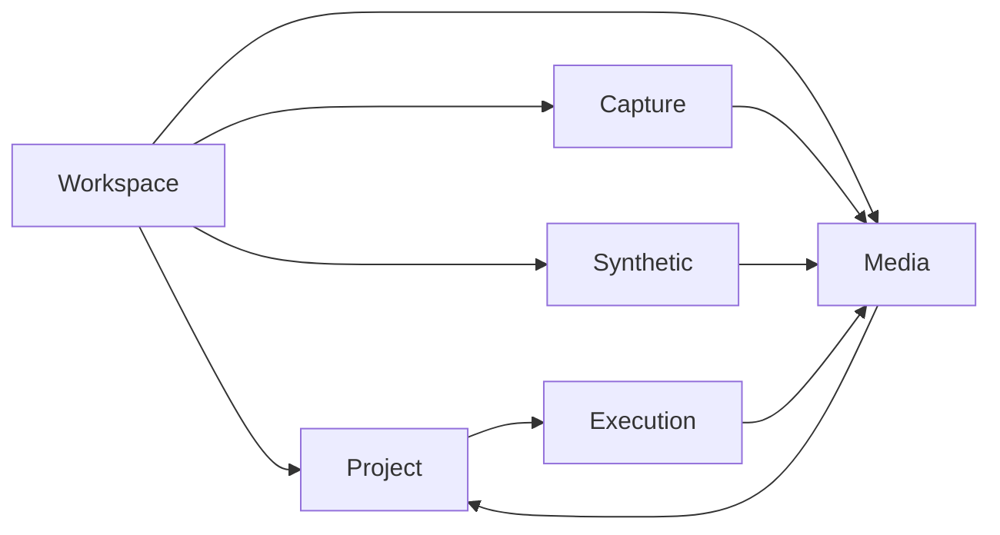
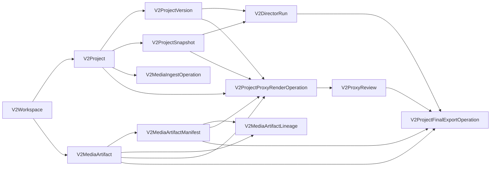

# Spec 10 — Mapa conceitual, ownership e persistência

Este inventário é a ponte auditável entre as entidades normativas do PRD 10.1–10.6 e a implementação V2. `planned` é uma lacuna explícita, não uma tabela genérica nem evidência de entrega.

## Grafo referencial central executavel

O caminho central usa FKs compostas, nao apenas IDs individualmente validos. Assim, uma versao ou snapshot de outro projeto e um manifest de outro artifact falham no banco antes de chegar ao Diretor ou ao renderer. A tabela abaixo e verificada contra o schema Prisma por `T-F0-033`; os campos referenciados tambem precisam formar uma chave primaria ou unica.

| Child model | Relation | FK fields | Parent model | Reference fields | On delete |
|---|---|---|---|---|---|
| V2Project | workspace | workspaceId | V2Workspace | id | Restrict |
| V2Project | currentVersion | currentVersionId,id,workspaceId | V2ProjectVersion | id,projectId,workspaceId | Restrict |
| V2ProjectSnapshot | project | projectId,workspaceId | V2Project | id,workspaceId | Cascade |
| V2ProjectVersion | project | projectId,workspaceId | V2Project | id,workspaceId | Cascade |
| V2ProjectVersion | parent | parentVersionId,projectId,workspaceId | V2ProjectVersion | id,projectId,workspaceId | Restrict |
| V2ProjectVersion | briefSnapshot | briefSnapshotId,projectId,workspaceId | V2ProjectSnapshot | id,projectId,workspaceId | Restrict |
| V2ProjectVersion | treatmentSnapshot | treatmentSnapshotId,projectId,workspaceId | V2ProjectSnapshot | id,projectId,workspaceId | Restrict |
| V2ProjectVersion | storySnapshot | storySnapshotId,projectId,workspaceId | V2ProjectSnapshot | id,projectId,workspaceId | Restrict |
| V2ProjectVersion | editPlanSnapshot | editPlanSnapshotId,projectId,workspaceId | V2ProjectSnapshot | id,projectId,workspaceId | Restrict |
| V2ProjectVersion | policiesSnapshot | policiesSnapshotId,projectId,workspaceId | V2ProjectSnapshot | id,projectId,workspaceId | Restrict |
| V2DirectorRun | project | projectId,workspaceId | V2Project | id,workspaceId | Cascade |
| V2DirectorRun | baseVersion | baseVersionId,projectId,workspaceId | V2ProjectVersion | id,projectId,workspaceId | Restrict |
| V2DirectorRun | resultVersion | resultVersionId,projectId,workspaceId | V2ProjectVersion | id,projectId,workspaceId | Restrict |
| V2DirectorRun | perceptionSnapshot | perceptionSnapshotId,projectId,workspaceId | V2ProjectSnapshot | id,projectId,workspaceId | Restrict |
| V2DirectorRun | treatmentSnapshot | treatmentSnapshotId,projectId,workspaceId | V2ProjectSnapshot | id,projectId,workspaceId | Restrict |
| V2DirectorRun | storySnapshot | storySnapshotId,projectId,workspaceId | V2ProjectSnapshot | id,projectId,workspaceId | Restrict |
| V2DirectorRun | editPlanSnapshot | editPlanSnapshotId,projectId,workspaceId | V2ProjectSnapshot | id,projectId,workspaceId | Restrict |
| V2DirectorRun | qualitySnapshot | qualitySnapshotId,projectId,workspaceId | V2ProjectSnapshot | id,projectId,workspaceId | Restrict |
| V2MediaArtifact | workspace | workspaceId | V2Workspace | id | Restrict |
| V2MediaArtifactManifest | artifact | artifactId,workspaceId | V2MediaArtifact | id,workspaceId | Restrict |
| V2MediaArtifactLineage | manifest | manifestId,workspaceId | V2MediaArtifactManifest | id,workspaceId | Restrict |
| V2MediaArtifactLineage | sourceArtifact | sourceArtifactId,workspaceId | V2MediaArtifact | id,workspaceId | Restrict |
| V2AssetRightsSnapshot | artifact | artifactId,workspaceId | V2MediaArtifact | id,workspaceId | Cascade |
| V2PublicOperation | workspace | workspaceId | V2Workspace | id | Restrict |
| V2PublicOperation | project | projectId,workspaceId | V2Project | id,workspaceId | Restrict; opcional apenas para artifact-render global |
| V2PublicOperationControlCommand | operation | operationId,workspaceId | V2PublicOperation | id,workspaceId | Cascade; somente transição efetiva de cancel/retry |
| V2PublicOperationControlCommand | actorClient | actorClientId,workspaceId | V2ApiClient | id,workspaceId | Restrict; audit tuple completo permanece interno |
| V2ProjectDirectorOperation | operation | operationId,workspaceId | V2PublicOperation | id,workspaceId | Cascade |
| V2ProjectDirectorOperation | project | projectId,workspaceId | V2Project | id,workspaceId | Restrict |
| V2ProjectDirectorOperation | baseVersion | baseVersionId,projectId,workspaceId | V2ProjectVersion | id,projectId,workspaceId | Restrict |
| V2DirectorRun | operation | operationId,workspaceId | V2ProjectDirectorOperation | operationId,workspaceId | Restrict; opcional para execuções síncronas anteriores |
| V2MediaIngestOperation | project | projectId,workspaceId | V2Project | id,workspaceId | Restrict |
| V2ArtifactRenderOperation | operation | operationId,workspaceId | V2PublicOperation | id,workspaceId | Cascade |
| V2ArtifactRenderOperation | artifact | artifactId,workspaceId | V2MediaArtifact | id,workspaceId | Restrict |
| V2ArtifactRenderOperation | manifest | manifestId,artifactId,workspaceId | V2MediaArtifactManifest | id,artifactId,workspaceId | Restrict |
| V2ProjectProxyRenderOperation | project | projectId,workspaceId | V2Project | id,workspaceId | Restrict |
| V2ProjectProxyRenderOperation | version | projectVersionId,projectId,workspaceId | V2ProjectVersion | id,projectId,workspaceId | Restrict |
| V2ProjectProxyRenderOperation | editPlanSnapshot | editPlanSnapshotId,projectId,workspaceId | V2ProjectSnapshot | id,projectId,workspaceId | Restrict |
| V2ProjectProxyRenderOperation | sourceArtifact | sourceArtifactId,workspaceId | V2MediaArtifact | id,workspaceId | Restrict |
| V2ProjectProxyRenderOperation | sourceManifest | sourceManifestId,sourceArtifactId,workspaceId | V2MediaArtifactManifest | id,artifactId,workspaceId | Restrict |
| V2ProxyReview | project | projectId,workspaceId | V2Project | id,workspaceId | Cascade |
| V2ProxyReview | projectVersion | projectVersionId,projectId,workspaceId | V2ProjectVersion | id,projectId,workspaceId | Restrict |
| V2ProxyReview | operation | operationId,projectId,workspaceId | V2ProjectProxyRenderOperation | operationId,projectId,workspaceId | Restrict |
| V2ProxyReview | proxyArtifact | proxyArtifactId,workspaceId | V2MediaArtifact | id,workspaceId | Restrict |
| V2ProxyReview | proxyManifest | proxyManifestId,proxyArtifactId,workspaceId | V2MediaArtifactManifest | id,artifactId,workspaceId | Restrict |
| V2ProjectFinalExportOperation | project | projectId,workspaceId | V2Project | id,workspaceId | Restrict |
| V2ProjectFinalExportOperation | version | projectVersionId,projectId,workspaceId | V2ProjectVersion | id,projectId,workspaceId | Restrict |
| V2ProjectFinalExportOperation | directorRun | directorRunId,projectId,workspaceId | V2DirectorRun | id,projectId,workspaceId | Restrict |
| V2ProjectFinalExportOperation | editPlanSnapshot | editPlanSnapshotId,projectId,workspaceId | V2ProjectSnapshot | id,projectId,workspaceId | Restrict |
| V2ProjectFinalExportOperation | qualitySnapshot | qualitySnapshotId,projectId,workspaceId | V2ProjectSnapshot | id,projectId,workspaceId | Restrict |
| V2ProjectFinalExportOperation | proxyReview | proxyReviewId,projectId,workspaceId | V2ProxyReview | id,projectId,workspaceId | Restrict |
| V2ProjectFinalExportOperation | proxyArtifact | proxyArtifactId,workspaceId | V2MediaArtifact | id,workspaceId | Restrict |
| V2ProjectFinalExportOperation | sourceArtifact | sourceArtifactId,workspaceId | V2MediaArtifact | id,workspaceId | Restrict |
| V2ProjectFinalExportOperation | sourceManifest | sourceManifestId,sourceArtifactId,workspaceId | V2MediaArtifactManifest | id,artifactId,workspaceId | Restrict |
| V2ProjectFinalExportAttempt | operation | operationId,workspaceId | V2ProjectFinalExportOperation | operationId,workspaceId | Cascade |
| V2ProjectFinalExportAttempt | outputArtifact | outputArtifactId,workspaceId | V2MediaArtifact | id,workspaceId | Restrict |
| V2ProjectFinalExportAttempt | outputManifest | outputManifestId,outputArtifactId,workspaceId | V2MediaArtifactManifest | id,artifactId,workspaceId | Restrict |

Os IDs de output na operacao de ingest, proxy e export final sao reservas deterministicas para um artifact que ainda nao existe quando o job e enfileirado. Por isso eles nao fingem ser FKs antecipadas. A integridade artifact/manifest passa a ser obrigatoria no registro terminal de `V2ProjectFinalExportAttempt`; inputs ja materializados permanecem protegidos no enqueue.

| PRD | Entity | Owner | Representation | Canonical target | Lifecycle / key |
|---|---|---|---|---|---|
| 10.1 | Workspace | Workspace | table | V2Workspace | root; id |
| 10.1 | WorkspaceMember | Workspace | table | V2WorkspaceMember | identity membership; workspaceId+identityId |
| 10.1 | WorkspaceBrandKit | Workspace | planned | gap: brand kit aggregate beyond LUTs | workspace versioned policy |
| 10.1 | WorkspaceGuardrails | Workspace | planned | gap: workspace guardrail snapshot | immutable policy version |
| 10.1 | LocaleProfile | Workspace | value-object | src/v2/domain/localization.ts#LocaleProfile | workspace+locale+version |
| 10.1 | DeliveryProfile | Workspace | planned | gap: reusable delivery profile | workspace+profile+version |
| 10.2 | Project | Project | table | V2Project | workspace child; id |
| 10.2 | ProjectVersion | Project | table | V2ProjectVersion | immutable version; projectId+id |
| 10.2 | ProductionBatch | Project | table | V2ProductionBatch | workspace root for batch; id |
| 10.2 | VariantRecipe | Project | table | V2VariantRecipeRun,V2VariantRecipeLineage | immutable run; batchId+id |
| 10.2 | DirectorBrief | Project | snapshot | V2ProjectSnapshot kind=brief | project version snapshot |
| 10.2 | BriefInterpretation | Project | value-object | src/v2/application/compile-brief.ts#CompiledBrief | content-addressed compile result |
| 10.2 | TreatmentPlan | Project | snapshot | V2ProjectSnapshot kind=treatment | project version snapshot |
| 10.2 | StoryPlan | Project | snapshot | V2ProjectSnapshot kind=story | project version snapshot |
| 10.2 | EditPlan | Project | snapshot | V2ProjectSnapshot kind=edit-plan | project version snapshot |
| 10.2 | FormatVariantPlan | Project | value-object | src/v2/domain/canonical-types.ts#FormatVariantPlan | editPlanId+format |
| 10.2 | LocalizationVariant | Project | value-object | src/v2/domain/localization.ts#LocalizationVariant | canonicalVersionId+locale |
| 10.2 | OutputSpec | Project | value-object | src/v2/domain/output-spec.ts#OutputSpec | immutable id in brief/version |
| 10.2 | ReviewAnnotation | Project | table | V2ReviewAnnotation | project+version scoped; id |
| 10.3 | MediaAsset | Media | table | V2MediaArtifact | workspace root; id |
| 10.3 | VideoAsset | Media | table | V2MediaArtifact | type=video; id |
| 10.3 | AudioAsset | Media | table | V2MediaArtifact | type=audio; id |
| 10.3 | ImageAsset | Media | table | V2MediaArtifact | type=image; id |
| 10.3 | DocumentAsset | Media | planned | gap: first-class document contract | workspace artifact identity |
| 10.3 | MediaDerivative | Media | table | V2MediaArtifact,V2MediaArtifactLineage | derived artifact+lineage |
| 10.3 | MediaSegment | Media | value-object | src/v2/domain/canonical-types.ts#MediaSegment | sourceId+frame range |
| 10.3 | SpeechSegment | Media | table | V2SpeechSegment | catalog run+segment id |
| 10.3 | EvidenceSegment | Media | table | V2EvidenceSegment | project+source+range |
| 10.3 | ValidatedSegment | Media | table | V2ValidatedSegment | immutable validation envelope |
| 10.3 | LongFormMoment | Media | table | V2LongFormMoment | index run+moment id |
| 10.3 | ImageAnalysis | Media | table | V2ImageAnalysis | workspace+artifact+manifest; analysis hash |
| 10.3 | MediaEmbedding | Media | table | V2SemanticSearchDocument | workspace+document id |
| 10.3 | AssetRights | Media | table | V2AssetRightsSnapshot | artifact+rights revision |
| 10.4 | CaptureSession | Capture | value-object | src/v2/domain/capture-synchronization.ts#CaptureSession | workspace session id |
| 10.4 | SourceTrack | Capture | value-object | src/v2/domain/capture-synchronization.ts#CaptureTrack | session+track id |
| 10.4 | TrackClip | Capture | planned | gap: persisted track clip contract | session+track+clip id |
| 10.4 | SyncAnchor | Capture | value-object | src/v2/domain/capture-synchronization.ts#SyncSignal | source/session time pair |
| 10.4 | SyncMap | Capture | value-object | src/v2/domain/capture-synchronization.ts#ClockPiece | track+ordered clock pieces |
| 10.4 | TrackCoverage | Capture | value-object | src/v2/domain/capture-synchronization.ts#CaptureTrack | track+covered ranges |
| 10.4 | SyncDiagnostic | Capture | value-object | src/v2/domain/capture-direction.ts#SyncDiagnostic | session+diagnostic version |
| 10.5 | PresenterProfile | Synthetic | planned | gap: presenter profile aggregate | workspace+presenter id |
| 10.5 | VoiceProfile | Synthetic | planned | gap: voice profile aggregate | presenter+voice id |
| 10.5 | ConsentRecord | Synthetic | planned | gap: immutable consent record | subject+scope+version |
| 10.5 | ProviderDefinition | Synthetic | planned | gap: provider registry persistence | provider+capability+version |
| 10.5 | ProviderCredentialRef | Synthetic | planned | gap: provider secret reference | workspace+provider+environment |
| 10.5 | ProviderJob | Synthetic | value-object | src/v2/domain/generative-transformation.ts#ProviderJob | operation+provider job id |
| 10.5 | SyntheticMasterAsset | Synthetic | planned | gap: consent-bound synthetic master | profile+artifact id |
| 10.5 | TransformationBrief | Synthetic | value-object | src/v2/domain/generative-transformation.ts#TransformationBrief | project version+brief id |
| 10.5 | TransformationArtifact | Synthetic | table | V2MediaArtifact,V2MediaArtifactLineage | generated artifact+lineage |
| 10.6 | WorkflowRun | Execution | table | V2PublicOperation | typed operation id |
| 10.6 | WorkflowStep | Execution | table | V2ProductionBatchStep,V2LongFormIndexStageCheckpoint | owning run+step id |
| 10.6 | ArtifactEvaluation | Execution | table | V2QualityIteration | project+iteration id |
| 10.6 | QualityReport | Execution | snapshot | V2ProjectSnapshot kind=quality-report | project version snapshot |
| 10.6 | DirectorDecision | Execution | table | V2DirectorRun | run+ordered decision id |
| 10.6 | RenderJob | Execution | table | V2ArtifactRenderOperation,V2ProjectProxyRenderOperation,V2ProjectFinalExportOperation | operation id |
| 10.6 | RenderArtifact | Execution | table | V2MediaArtifact,V2MediaArtifactManifest | artifact+manifest id |
| 10.6 | ArtifactLineage | Execution | table | V2MediaArtifactLineage | child+ordinal source |

## Regras

- `table` aponta somente para models tipados existentes em `prisma/v2/schema.prisma`.
- `snapshot` aponta para `V2ProjectSnapshot` e declara o kind imutável.
- `value-object` aponta para um símbolo exportado real.
- `planned` é falha de cobertura visível e nunca autoriza blob/tabela genérica.

## Compatibilidade dos contratos centrais

| Contract | Canonical implementation | Specs | Compatibility decision |
|---|---|---|---|
| SourceAsset | `V2MediaArtifact` + `media-artifact-manifest/v1+` + rights snapshot | 03 | identidade/checksum/lineage são canônicos; localização permanente não atravessa domínio/API; `DocumentAsset` segue lacuna explícita |
| TimelineSegment | `EditorialCutClip` + `clip-timing.ts` | 02 | source/timeline são frames semiabertos; rate é positivo e frame-first; reverse falha fechado |
| OutputSpec | `output-spec.ts#OutputSpec` | 02 | locale, canvas par, fps, ratio e safe-area normalizada são validados antes do RenderInput |
| AsyncMediaProviderAdapter | `application/ports/async-media-provider.ts` | 06 | capabilities com TTL, estimate, submit idempotente, status, retrieve, cancel e webhook ficam atrás do port; secrets não pertencem ao contrato |
| EditCommand | `edit-command.ts#EditCommand` + `edit-command-registry.ts` | 02 | base version/hash, actor, scope, payload, idempotência e política de invalidação registrada são obrigatórios |
